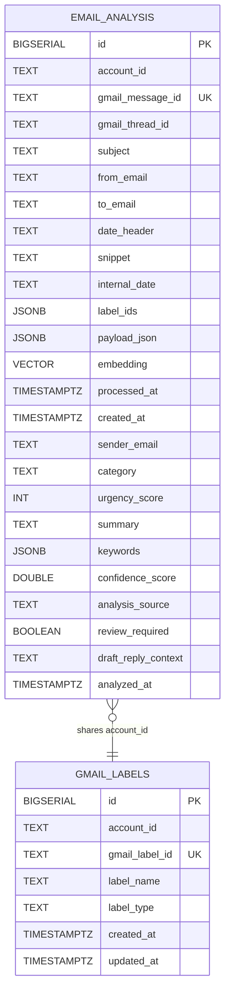

# 📬 ArrangeBox

ArrangeBox는 단순히 이메일을 지우는 도구를 넘어, 환경을 생각하는 **디지털 지속가능성**을 실천하는 AI 기반 이메일 정리 서비스입니다.

저는 읽지 않은 채 쌓여있는 수만 통의 이메일이 데이터 센터의 에너지를 소모하며 실시간으로 탄소를 배출한다는 점에 주목했습니다. ArrangeBox는 이메일함 구석구석 쌓인 이 메일들을 **탄소 먼지**로 정의하고, 사용자가 이를 정리 바구니에 담아 비워냄으로써 마음의 평화와 환경적 가치를 동시에 얻을 수 있도록 돕습니다.

|List| Repository | GitHub |
|------|------|------|
|ArrangeBox-Backend| 🟠 **ArrangeBox-Backend (Python)** |  |

---

## ✨ Features
| 기능 | 화면 |
|:---:|-----|
| 메인화면 |  |
| 이메일 연동 |  |
| 정리 바구니에 담기 |  |
| 중요 + 별표 작업 |  |
| 삭제 작업 |  |

---

| 구분 | 기술 |
| ------------------------- | -------------------------------- |
| Backend | Python 3.12, FastAPI, Uvicorn |
| Frontend | React (TypeScript), Vite |
| AI API | Gemini API (2.0 Flash-Lite) |
| Auth / External API | Google OAuth2, Gmail API |
| Message Queue | Kafka (KRaft) |
| Database | PostgreSQL |
| Cache / Temporary Storage | Redis |
| Styling / Animations | Tailwind CSS |

---

## 📊 ERD

---

## Architecture

